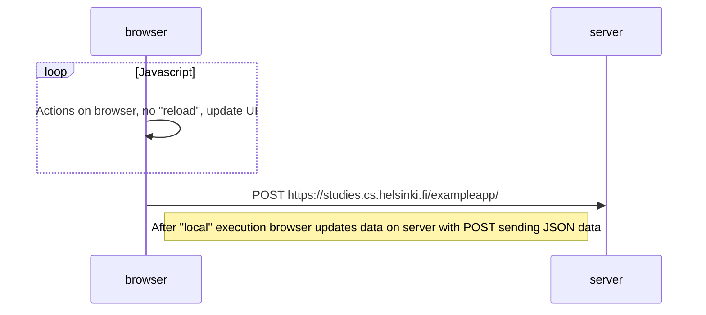

```mermaid
sequenceDiagram
    participant browser
    participant server

    loop Javascript
        browser->>browser: Actions on browser, no "reload", update UI
    end
    browser->>server: POST https://studies.cs.helsinki.fi/exampleapp/
    Note right of browser: After "local" execution browser updates data on server with POST sending JSON data
```
